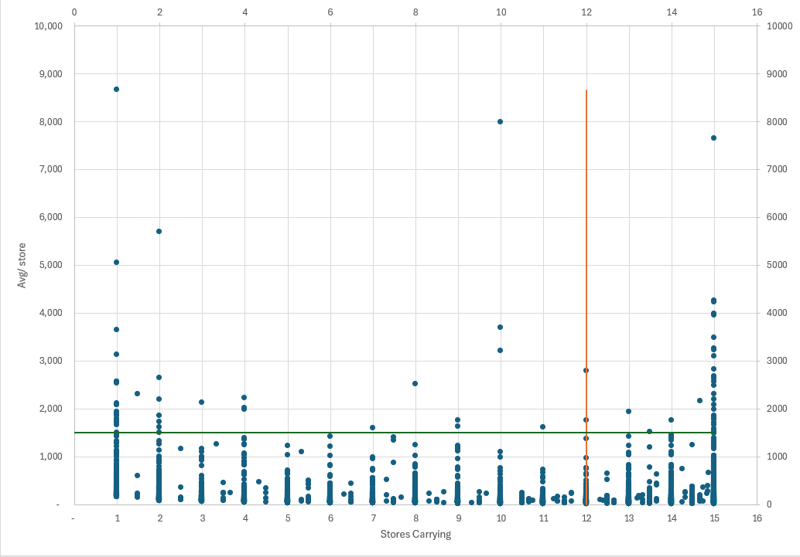

# Retail Product Performance Analysis

## Project Overview

This project analyzes more than 13,000 retail products across 15 store locations to identify product performance trends, distribution gaps, and potential opportunities for assortment optimization.

The primary goal was to answer two business questions:

1. Which high-performing products may benefit from expansion into additional stores?
2. Which broadly distributed products are underperforming and may warrant further review?

The project uses **Excel, Tableau, and PostgreSQL** to demonstrate the complete analytical workflow from data cleaning and exploratory analysis to interactive visualization and SQL querying.

---

## Tools Used

- Microsoft Excel — data cleaning, exploratory analysis, and pivot tables
- PostgreSQL / SQL — data validation and analytical queries
- Tableau — interactive data visualization
- Power BI — DAX measures, KPI development, interactive filtering, and dashboard reporting

---

## Dataset

The dataset contains **13,000+ retail products across 15 store locations**.

Key fields include:

- UPC
- Product Description
- Units sold by store
- Total Units
- Average Units per Carrying Store
- Stores Carrying Product

The original dataset contained individual movement values for each store. During cleaning, additional metrics were created to better evaluate product performance and distribution.

---

## Excel Analysis

Excel was used to clean, validate, and prepare the dataset for analysis.

### Data Preparation

Key steps included:

- Inspected the raw dataset for missing and duplicate records
- Standardized store identifiers
- Verified product and UPC fields
- Calculated **Total Units** across all locations
- Calculated **Stores Carrying** for each product
- Corrected Average per Store to measure sales only across locations actually carrying the product
- Separated Meat Department records for more accurate product-level analysis using UPC identifiers

### Product Performance Analysis

A product-level analysis was created using:

- Total Units
- Average Units per Carrying Store
- Number of Stores Carrying Each Product

A scatter plot was then used to compare:

**X-Axis:** Stores Carrying  
**Y-Axis:** Average Units per Carrying Store

This provides a simple way to identify products with strong performance but limited distribution, as well as broadly distributed products with weaker performance.



---

## Tableau Dashboard

I developed an interactive Tableau dashboard to evaluate product performance and distribution across 15 retail locations.

The dashboard allows users to:

- Filter products by average sales per store and number of stores carrying the product.
- Compare total unit sales across products using an interactive ranked bar chart.
- Select individual products to generate a dynamic product assessment.
- Identify expansion opportunities for products performing well with limited distribution.
- Identify removal opportunities for products performing poorly despite wide distribution.
- Classify products into actionable recommendations including expansion, maintain, monitor, and removal categories.

### Business Purpose

The dashboard was designed to turn product-level sales data into actionable inventory and distribution decisions. Rather than simply showing which products sold the most units, the analysis considers both **sales performance per store** and **distribution reach** to identify products that may benefit from expanded distribution or reduced shelf presence.


### Interactive Tableau Dashboard

**[View the Interactive Tableau Dashboard](https://public.tableau.com/app/profile/michael.cline4297/viz/RetailProductPerformanceAnalysis_17889461538390/Sheet1)**

---

## SQL Analysis

The cleaned dataset was imported into **PostgreSQL** for further analysis.

Eight SQL queries were developed to examine product performance from multiple perspectives.

The analysis included:

1. Overall dataset and product performance summary
2. Top products by total units sold
3. Top products by average units per carrying store
4. High-performing products with limited distribution
5. Low-performing products with broad distribution
6. Identification of specific stores not carrying high-performing products
7. Product distribution by number of stores
8. Total product movement by store

The SQL analysis demonstrates the use of:

- `SELECT`
- `WHERE`
- `ORDER BY`
- `GROUP BY`
- Aggregate functions
- `CASE`
- `CONCAT_WS`
- Conditional filtering
- PostgreSQL `LATERAL` and `VALUES`

The complete SQL analysis is available here:

**[View SQL Analysis](SQL/retail_product_performance_analysis.sql)**

---

## Business Applications

The analysis provides a framework for retail management to identify products that deserve further investigation.

### Potential Expansion Opportunities

Products with:

- Strong average sales per carrying store
- Limited current distribution

may represent opportunities for expansion into additional store locations.

SQL was also used to identify the **specific stores where these products are not currently carried**, providing a more actionable starting point for distribution review.

### Potential Product Review Opportunities

Products with:

- Weak average performance
- Broad distribution across the store network

may warrant further review for assortment changes or reduced distribution.

These results should be treated as **decision-support indicators rather than automatic product removal recommendations**. Additional factors such as profit margin, shelf space, seasonality, inventory availability, and strategic product assortment would be considered before making final merchandising decisions.

---

## Performance Thresholds

A **1,500-unit average-per-store threshold** was used as an exploratory business benchmark during the analysis.

Rather than treating this value as a statistically determined cutoff, the Tableau dashboard allows the performance threshold to be adjusted interactively.

This enables decision-makers to test different performance expectations and immediately see how the product landscape changes.

A distribution benchmark of **12 stores** was used to distinguish broadly distributed products from products with greater potential distribution availability.

---

## Repository Structure

```text
retail-product-performance-analysis/
│
├── README.md
│
├── Excel/
│   └── Retail_Product_Performance_Analysis.xlsx
│
├── SQL/
│   └── retail_product_performance_analysis.sql
│
└── Images/
    ├── excel_product_performance.png
    └── tableau_product_performance.png
