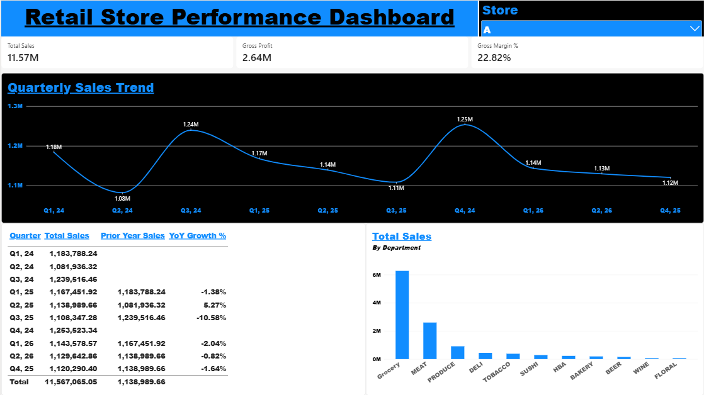

# Retail Store Performance Dashboard — Power BI

## Overview

This Power BI dashboard provides an interactive summary of retail store performance across multiple locations from Q1 2024 through Q2 2026.

The dashboard was designed to give management a simple way to monitor sales performance, profitability, departmental performance, and year-over-year trends while allowing results to be filtered by individual store.

## Dashboard

## Key Metrics

- Total Sales
- Gross Profit
- Gross Margin %
- Prior-Year Sales
- Year-over-Year Sales Growth %

## Dashboard Features

- Interactive store filtering
- Quarterly sales trend analysis
- Department-level sales performance
- Year-over-year sales comparisons
- Dynamic KPI calculations based on selected store

## Power BI Skills Demonstrated

- Power Query data preparation and validation
- DAX measures
- Filter context
- KPI development
- Interactive slicers
- Time-series analysis
- Data visualization
- Dashboard design

## DAX Measures

Key measures created for the dashboard include:

- Total Sales
- Total COGS
- Gross Profit
- Gross Margin %
- Total Wages
- Total Supplies
- Prior-Year Sales
- YoY Sales Growth %

## Files

- `RetailStorePerformance.pbix` — Power BI Desktop project
- `PowerBI_Dashboard_RSPD.png` — Dashboard preview
